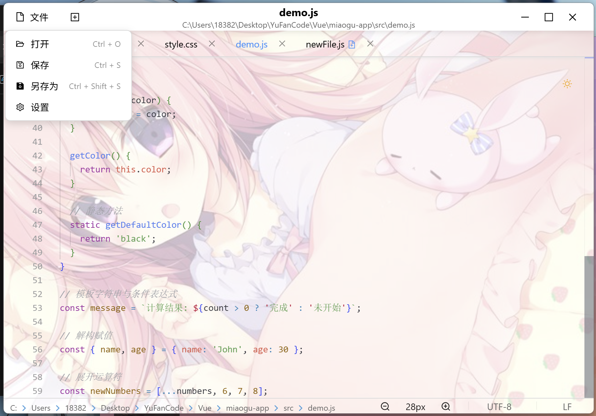
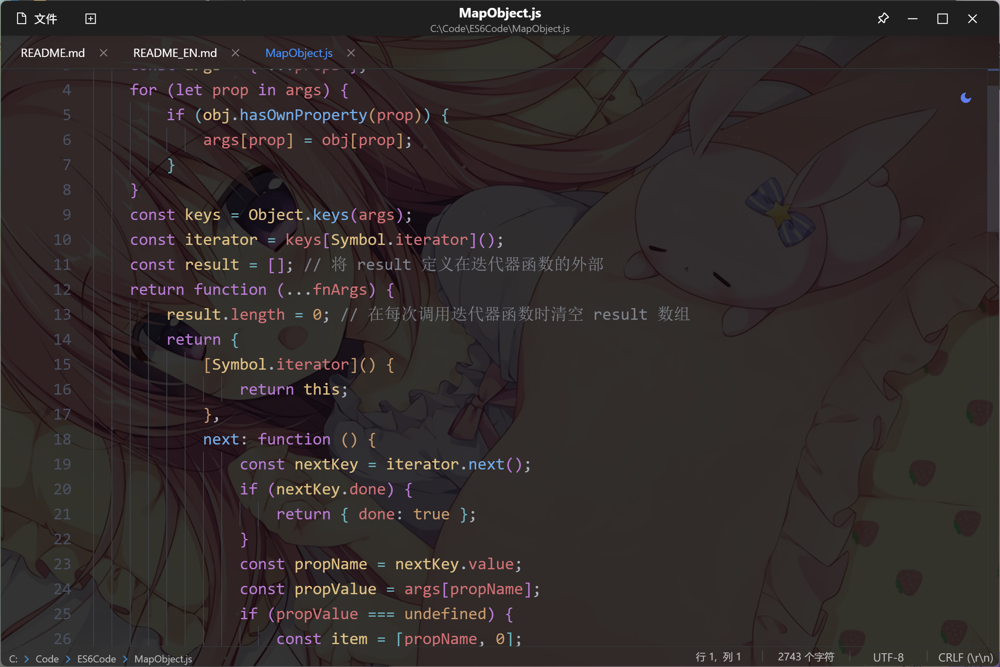

# 喵咕记事本

**Language / 语言**: 中文 | [English](README_EN.md)

    

**喵咕记事本** 是一款基于 Tauri + React + Monaco Editor 构建的轻量化代码记事本。结合了桌面应用的性能优势和现代 Web 技术的灵活性，集成 **AI 智能补全引擎**、**树形编辑器**、**Markdown实时渲染**等强大功能，提供简洁、流畅、智能的代码编辑和知识管理体验。

>  ⚡**Tauri 轻量化优势**：基于 Rust + 系统 WebView 架构，打包生成 **单个 exe 文件**，体积 **< 17MB**
>
>  **为什么 Tauri 能生成单个 exe 文件？**
> 1. **静态编译**：Rust 将所有依赖编译成单个二进制文件
> 2. **系统 WebView**：复用操作系统内置的浏览器引擎，无需打包
> 3. **资源嵌入**：前端资源直接嵌入到 Rust 二进制中
> 4. **零运行时**：无需额外的运行时环境（如 Node.js、.NET）

## 🚀 核心特性

### 🌳 树形编辑器
- **可视化编辑**：全新的树状结构编辑器，支持节点的增删改查
- **拖拽操作**：支持节点拖拽重排，直观调整树形结构
- **折叠展开**：支持节点折叠/展开，便于管理复杂的层级结构
- **实时同步**：编辑器与预览模式实时同步，所见即所得
- **mgtree语法**：内置专用树状图语法，支持知识脉络可视化

### 📝 Markdown实时渲染
- **实时预览**：支持完整的Markdown语法渲染，包括标题、列表、链接、图片等
- **代码高亮**：集成Prism.js，支持多种编程语言的语法高亮
- **缩放功能**：支持Ctrl+滚轮缩放预览内容，提供更好的阅读体验
- **响应式布局**：自适应不同屏幕尺寸，保持最佳显示效果

### 📊 Mermaid图表支持
- **流程图**：支持flowchart、graph等流程图语法
- **时序图**：支持sequenceDiagram时序图绘制
- **甘特图**：支持gantt甘特图项目管理
- **主题适配**：图表主题自动适配应用的明暗模式

### 🤖 AI 智能补全
- **实时代码补全**：基于上下文的智能代码建议，支持多种编程语言
- **内联补全显示**：代码补全结果直接在编辑器中以灰色文本显示
- **智能重试机制**：自动处理网络异常，确保补全服务稳定可用
- **低容忍过滤**：智能过滤无效补全，提供高质量代码建议
- **可配置 API**：支持自定义 AI 补全服务端点和参数

### 💻 编辑器功能
- **代码高亮**：基于 Monaco Editor 的专业级语法高亮，支持多种编程语言
- **多标签页**：支持同时编辑多个文件，便捷的标签页管理
- **文件管理**：完整的文件操作支持（新建、打开、保存、重命名等）
- **预览模式**：支持编辑器与预览模式的无缝切换
- **窗口置顶**: 置顶/取消置顶，便捷办公
- **打开方式**: 支持文件设置此项目为打开方式 / 终端打开文件
- **快速插入**：通过 Ctrl + G 快捷键快速插入预定义文本模板

### 🎨 界面体验
- **主题切换**：内置明暗主题，适配不同使用场景
- **View Transition**：使用现代Web API实现丝滑的界面过渡动画
- **国际化支持**：完整的中英文界面切换支持
- **单文件部署**：打包生成单个 exe 文件，无需安装，即下即用
- **极致轻量**：应用体积仅 **< 17MB**，相比 Electron 应用减少 90%+ 体积
- **零依赖运行**：无需预装 Node.js、.NET Framework 等运行时环境

## 📸 页面截图展示

| 浅色模式                      | 深色模式                     |
| ----------------------------- | ---------------------------- |
|  |  |

## 🛠 技术架构

| 层级               | 技术组件                           |
| ------------------ | ---------------------------------- |
| **桌面层**   | Tauri (Rust)                       |
| **前端层**   | React + Ant Design + Monaco Editor |
| **状态管理** | Redux Toolkit + Redux Persist      |
| **文件系统** | Tauri File System API              |
| **构建工具** | Vite + Tauri CLI                   |
| **样式处理** | Sass + CSS Modules                 |

## 📂 项目结构

```
miaogu-notepad/
├── src/                    # 前端源码
│   ├── components/         # React 组件
│   │   ├── AppHeader.jsx   # 应用头部（菜单栏）
│   │   ├── TabBar.jsx      # 标签页管理
│   │   ├── CodeEditor.jsx  # Monaco 编辑器
│   │   ├── EditorStatusBar.jsx # 状态栏
│   │   └── SettingsModal.jsx   # 设置弹窗
│   ├── hooks/              # 自定义 Hooks
│   │   ├── useFileManager.js   # 文件管理逻辑
│   │   ├── useSessionRestore.js # 会话恢复
│   │   └── redux.js        # Redux 相关 Hooks
│   ├── store/              # Redux 状态管理
│   ├── utils/              # 工具函数
│   │   └── tauriApi.js     # Tauri API 封装
│   ├── App.jsx             # 主应用组件
│   └── main.jsx            # 应用入口
├── src-tauri/              # Tauri 后端（Rust）
│   ├── src/                # Rust 源码
│   ├── icons/              # 应用图标
│   ├── Cargo.toml          # Rust 依赖配置
│   └── tauri.conf.json     # Tauri 配置
├── public/                 # 静态资源
├── package.json            # Node.js 依赖
└── vite.config.js          # Vite 构建配置
```

## 🛠️ 开发准备

### 环境要求

- **Node.js** ≥ 18.0 (前端构建)
- **Rust** ≥ 1.70 (后端编译)
- **系统 WebView**：
  - Windows: WebView2 (Win10+ 自带)
  - macOS: WebKit (系统自带)
  - Linux: WebKitGTK
- **系统要求**：Windows 10+, macOS 10.15+, 或现代 Linux 发行版

### Tauri 单文件打包原理

**为什么 Tauri 能生成单个 exe 文件？**

1. **静态编译**：Rust 将所有依赖编译成单个二进制文件
2. **系统 WebView**：复用操作系统内置的浏览器引擎，无需打包
3. **资源嵌入**：前端资源直接嵌入到 Rust 二进制中
4. **零运行时**：无需额外的运行时环境（如 Node.js、.NET）

### 安装 Rust 和 Tauri CLI

```bash
# 安装 Rust
curl --proto '=https' --tlsv1.2 -sSf https://sh.rustup.rs | sh

# 安装 Tauri CLI
cargo install tauri-cli
```

### 启动开发环境

```bash
# 克隆项目
git clone <repository-url>
cd miaogu-notepad

# 安装前端依赖
npm install

# 启动开发模式（同时启动前端和 Tauri）
npm run tauri:dev

# 或者分别启动
npm run dev          # 启动前端开发服务器
npm run tauri dev    # 启动 Tauri 开发模式
```

### 构建打包

```bash
# 构建生产版本
npm run tauri:build

# 构建结果将在 src-tauri/target/release/bundle/ 目录下
```

## 🎯 主要功能

### 🌳 树形结构编辑

#### Tree语法在Markdown中的三种定义方式

喵咕记事本支持在Markdown文档中通过三种方式定义和使用树状结构：

**1. 内联树状图 (tree代码块)**
```tree
根节点
  子节点1
    子子节点1 >java[1]
    子子节点2 >python[1]
  子节点2 >javascript[2]
  子节点3
    深层节点 >java[2]
```

**2. 外部文件引用 (@tree()语法)**
```tree
@tree(algorithm-tree)
```
这种方式会自动查找 `trees/algorithm-tree.mgtree` 文件并渲染其内容。

**3. 自动关联 (H1标题自动匹配)**
当Markdown文档中存在H1标题时，系统会自动查找同名的mgtree文件：
```md
# 数据结构与算法
```
系统会自动查找并渲染 `trees/数据结构与算法.mgtree` 文件。

#### 跳转节点功能详解

**跳转节点**是树状图的核心功能，允许从树节点直接跳转到Markdown文档中对应的代码块：

##### 四种跳转语法

**1. 显式索引跳转**
```
节点名称 >java[2]
```
跳转到文档中第2个java代码块

**2. 递增跳转**
```
基础语法 >java[1]
进阶用法 >java++
高级特性 >java++
```
自动递增索引：1 → 2 → 3

**3. 跳跃增加**
```
基础概念 >python[1]
实战项目 >python+=3
```
从索引1跳跃到索引4

**4. 同索引复用**
```
理论基础 >javascript[1]
相关概念 >javascript
```
复用上一个索引值

##### 跳转功能特性

- **精确定位**：根据语言类型和索引精确跳转到对应代码块
- **视觉反馈**：跳转后目标代码块会高亮显示3秒
- **平滑滚动**：使用smooth滚动动画提升用户体验
- **错误提示**：当目标代码块不存在时显示友好的错误信息
- **多语言支持**：支持所有Prism.js支持的编程语言

### 📝 文件操作

- 新建文件 (`Ctrl+N`)
- 打开文件 (`Ctrl+O`)
- 保存文件 (`Ctrl+S`)
- 另存为 (`Ctrl+Shift+S`)
- 文件重命名（双击标签页标题）
- 预览模式切换

### ✨ 编辑功能

- **AI内联补全**：智能代码建议
- **幽灵文本** (`Ctrl+G`)：快速插入模板
- **语法高亮**：支持主流编程语言
- **代码折叠**：结构化代码管理
- **自动缩进**：智能格式化
- **括号匹配**：配对高亮显示
- **多光标编辑**：批量编辑操作
- **查找替换** (`Ctrl+F`, `Ctrl+H`)：强大的搜索功能

### 🎨 界面特性

- **多标签页管理**：高效的文件切换
- **明暗主题切换**：护眼模式支持
- **响应式布局**：适配各种屏幕尺寸
- **状态栏信息**：实时显示行列号、文件类型、编码等
- **View Transition动画**：流畅的界面过渡效果
- **国际化界面**：中英文无缝切换

## 🔧 配置说明

应用设置通过 Tauri Store 插件持久化存储，包括：

- **AI 补全设置**：API 端点配置、补全开关、重试参数等
- **主题设置**：明暗模式切换、界面语言选择
- **编辑器配置**：字体大小、主题、自动保存等
- **预览设置**：Markdown渲染选项、缩放比例等
- **树形编辑器**：节点样式、跳转行为配置
- **会话管理**：自动恢复上次打开的文件

### AI 补全配置

在设置面板中可以配置：
- **API 端点**：自定义 AI 补全服务地址
- **启用状态**：开启/关闭 AI 补全功能
- **请求超时**：设置 API 请求超时时间
- **重试次数**：网络异常时的自动重试次数

### 幽灵文本配置

- **模板管理**：自定义常用文本模板
- **快捷键设置**：配置触发快捷键（默认Ctrl+G）
- **上下文感知**：开启/关闭智能提示
- **模板分类**：按语言或用途分类管理模板

### 树形编辑器配置

- **跳转行为**：配置点击跳转节点的行为
- **节点样式**：自定义树节点的显示样式
- **折叠状态**：设置默认的节点折叠行为
- **拖拽设置**：启用/禁用节点拖拽功能

## 🤝 贡献指南

欢迎通过 GitHub 提交 PR：

1. Fork 本仓库
2. 创建特性分支 (`git checkout -b feature/你的特性名称`)
3. 提交你的代码 (`git commit -m 'feat: 添加了某某特性'`)
4. 推送到远端分支 (`git push origin feature/你的特性名称`)
5. 创建 Pull Request

## 📄 许可证

本项目采用 MIT 许可证 - 查看 [LICENSE](LICENSE) 文件了解详情。

## 🙏 致谢

- [Tauri](https://tauri.app/) - 现代桌面应用框架
- [Monaco Editor](https://microsoft.github.io/monaco-editor/) - VS Code 同款编辑器
- [React](https://reactjs.org/) - 用户界面库
- [Ant Design](https://ant.design/) - 企业级 UI 设计语言

---

**喵咕记事本** - 让代码编辑更简单、更高效！ ✨
