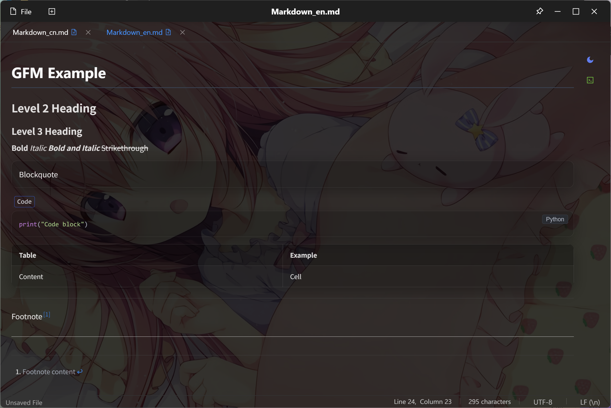

# Miaogu Notepad

**Language / 语言**: [中文](README.md) | English

    

**Miaogu Notepad** is an lightweight notepad built with Tauri + React + Monaco Editor. It combines the performance advantages of desktop applications with the flexibility of modern web technologies, integrating **AI Smart Completion Engine** to provide a clean, smooth, and intelligent code editing experience.

> ⚡**Tauri Lightweight Advantage**: Based on Rust + System WebView architecture, packaged as a **single exe file**, size **< 18MB**
>
> **Why can Tauri generate a single exe file?**
>
> 1. **Static Compilation**: Rust compiles all dependencies into a single binary file
> 2. **System WebView**: Reuses the operating system's built-in browser engine, no need to package
> 3. **Resource Embedding**: Frontend resources are directly embedded into the Rust binary
> 4. **Zero Runtime**: No additional runtime environment required (such as Node.js, .NET)

## 🚀 Core Features

### 🌳 Tree Editor
- **Visual Editing**: Brand new tree structure editor supporting node CRUD operations
- **Drag & Drop**: Support node drag-and-drop reordering for intuitive tree structure adjustment
- **Collapse/Expand**: Support node collapse/expand for managing complex hierarchical structures
- **Real-time Sync**: Editor and preview mode sync in real-time, WYSIWYG
- **mgtree Syntax**: Built-in dedicated tree diagram syntax supporting knowledge context visualization

### 📝 Markdown Real-time Rendering
- **Live Preview**: Support complete Markdown syntax rendering including headers, lists, links, images, etc.
- **Code Highlighting**: Integrated Prism.js supporting syntax highlighting for multiple programming languages
- **Zoom Function**: Support Ctrl+scroll wheel to zoom preview content for better reading experience
- **Responsive Layout**: Adaptive to different screen sizes maintaining optimal display

### 📊 Mermaid Chart Support
- **Flowcharts**: Support flowchart and graph syntax
- **Sequence Diagrams**: Support sequenceDiagram sequence diagram drawing
- **Gantt Charts**: Support gantt chart project management
- **Theme Adaptation**: Chart themes automatically adapt to application light/dark mode

### 🤖 AI Smart Completion
- **Real-time Code Completion**: Context-aware intelligent code suggestions supporting multiple programming languages
- **Inline Completion Display**: Code completion results displayed directly in the editor as gray text
- **Smart Retry Mechanism**: Automatically handles network exceptions to ensure stable completion service
- **Low-tolerance Filtering**: Intelligently filters invalid completions, providing high-quality code suggestions
- **Configurable API**: Support for custom AI completion service endpoints and parameters

### 💻 Editor Features
- **Code Highlighting**: Professional-grade syntax highlighting based on Monaco Editor, supporting multiple programming languages
- **Multi-tab Support**: Edit multiple files simultaneously with convenient tab management
- **File Management**: Complete file operation support (new, open, save, rename, etc.)
- **Preview Mode**: Support seamless switching between editor and preview modes
- **Window Always on Top**: Pin/unpin window, convenient for office work
- **Custom Command Startup**: Support setting this project as default opener / open files from terminal
- **Automatic Update Detection**: Built-in update checker for the latest version notifications
- **Quick Insert**: Quick insert predefined text templates via Ctrl + G shortcut

### 🎨 Interface Experience
- **Theme Switching**: Built-in light/dark themes, adapting to different usage scenarios
- **View Transition**: Smooth interface transition animations using modern Web APIs
- **Internationalization**: Complete Chinese/English interface switching support
- **Single File Deployment**: Packaged as a single exe file, no installation required, download and use
- **Ultra Lightweight**: Application size only **< 18MB**, 90%+ size reduction compared to Electron apps
- **Zero Dependency Runtime**: No need to pre-install Node.js, .NET Framework, or other runtime environments

## 📦 Installation Guide

### Windows Installation

**🎯 Single EXE File (Most Recommended)**
- **File**: `miaogu-notepad-x.x.x-windows-x64.exe`
- **Features**: Single file, no installation required, download and run directly
- **Size**: ~11.5 MB
- **Usage**: Double-click to run, supports portable usage

**MSI Installer**
- **File**: `miaogu-notepad-x.x.x-windows-x64.msi`
- **Features**: Standard Windows installer, automatic PATH integration
- **Size**: ~11.8 MB
- **Usage**: Double-click to install, creates Start Menu shortcuts

### macOS Installation

**Apple Silicon (M1/M2/M3)**
- **File**: `miaogu-notepad-x.x.x-macos-aarch64.dmg`
- **Features**: Optimized for Apple Silicon chips
- **Size**: ~10.2 MB
- **Usage**: Open DMG and drag to Applications folder

**Intel Chips**
- **File**: `miaogu-notepad-x.x.x-macos-x64.dmg`
- **Features**: Compatible with Intel-based Macs
- **Size**: ~10.8 MB
- **Usage**: Open DMG and drag to Applications folder

### Linux Installation

**DEB Package (Ubuntu/Debian)**
```bash
# Download and install
wget https://github.com/your-repo/releases/download/vx.x.x/miaogu-notepad-x.x.x-linux-amd64.deb
sudo dpkg -i miaogu-notepad-x.x.x-linux-amd64.deb
```

**RPM Package (CentOS/RHEL/Fedora)**
```bash
# Download and install
wget https://github.com/your-repo/releases/download/vx.x.x/miaogu-notepad-x.x.x-linux-x86_64.rpm
sudo rpm -i miaogu-notepad-x.x.x-linux-x86_64.rpm
```

**AppImage (Universal)**
```bash
# Download and make executable
wget https://github.com/your-repo/releases/download/vx.x.x/miaogu-notepad-x.x.x-linux-x86_64.AppImage
chmod +x miaogu-notepad-x.x.x-linux-x86_64.AppImage
./miaogu-notepad-x.x.x-linux-x86_64.AppImage
```

### Installation Notes

- **System Requirements**: Windows 10+, macOS 10.15+, or modern Linux distributions
- **WebView Dependencies**: 
  - Windows: WebView2 (built-in on Windows 10+)
  - macOS: WebKit (system built-in)
  - Linux: WebKitGTK (usually pre-installed)
- **No Runtime Required**: No need to install Node.js, .NET, or other runtime environments
- **Automatic Updates**: Built-in update checker for the latest version notifications

## 📸 Screenshots

| Light Mode                        | Dark Mode                       |
| --------------------------------- | ------------------------------- |
|  |  |

| 树编辑器                      | Markdown渲染                     |
| ----------------------------- | ---------------------------- |
|  |  |

## 🛠 Technical Architecture

| Layer                      | Technology Components              |
| -------------------------- | ---------------------------------- |
| **Desktop Layer**    | Tauri (Rust)                       |
| **Frontend Layer**   | React + Ant Design + Monaco Editor |
| **State Management** | Redux Toolkit + Redux Persist      |
| **File System**      | Tauri File System API              |
| **Build Tools**      | Vite + Tauri CLI                   |
| **Style Processing** | Sass + CSS Modules                 |

## 📂 Project Structure

```treeview
miaogu-notepad/
├── src/                    # Frontend source code
│   ├── components/         # React components
│   │   ├── AppHeader.jsx   # App header (menu bar)
│   │   ├── TabBar.jsx      # Tab management
│   │   ├── CodeEditor.jsx  # Monaco editor
│   │   ├── EditorStatusBar.jsx # Status bar
│   │   └── SettingsModal.jsx   # Settings modal
│   ├── hooks/              # Custom Hooks
│   │   ├── useFileManager.js   # File management logic
│   │   ├── useSessionRestore.js # Session restore
│   │   └── redux.js        # Redux related Hooks
│   ├── store/              # Redux state management
│   ├── utils/              # Utility functions
│   │   └── tauriApi.js     # Tauri API wrapper
│   ├── App.jsx             # Main app component
│   └── main.jsx            # App entry point
├── src-tauri/              # Tauri backend (Rust)
│   ├── src/                # Rust source code
│   ├── icons/              # App icons
│   ├── Cargo.toml          # Rust dependency config
│   └── tauri.conf.json     # Tauri configuration
├── public/                 # Static assets
├── package.json            # Node.js dependencies
└── vite.config.js          # Vite build config
```

## 🛠️ Development Setup

### Requirements

- **Node.js** ≥ 18.0 (frontend build)
- **Rust** ≥ 1.70 (backend compilation)
- **System WebView**:
  - Windows: WebView2 (built-in on Win10+)
  - macOS: WebKit (system built-in)
  - Linux: WebKitGTK
- **System Requirements**: Windows 10+, macOS 10.15+, or modern Linux distributions

### Tauri Single File Packaging Principle

**Why can Tauri generate a single exe file?**

1. **Static Compilation**: Rust compiles all dependencies into a single binary file
2. **System WebView**: Reuses the operating system's built-in browser engine, no need to package
3. **Resource Embedding**: Frontend resources are directly embedded into the Rust binary
4. **Zero Runtime**: No additional runtime environment required (such as Node.js, .NET)

### Install Rust and Tauri CLI

```bash
# Install Rust
curl --proto '=https' --tlsv1.2 -sSf https://sh.rustup.rs | sh

# Install Tauri CLI
cargo install tauri-cli
```

### Start Development Environment

```bash
# Clone project
git clone <repository-url>
cd miaogu-notepad

# Install frontend dependencies
npm install

# Start development mode (starts both frontend and Tauri)
npm run tauri:dev

# Or start separately
npm run dev          # Start frontend dev server
npm run tauri dev    # Start Tauri development mode
```

### Build and Package

```bash
# Build production version
npm run tauri:build

# Build results will be in src-tauri/target/release/bundle/ directory
```

## 🎯 Main Features

### 🌳 Tree Structure Editing

#### Three Ways to Define Tree Syntax in Markdown

Miaogu Notepad supports defining and using tree structures in Markdown documents through three methods:

**1. Inline Tree Diagram (```tree code block)**
```tree
Root Node
  Child Node 1
    Sub-child Node 1 >java[1]
    Sub-child Node 2 >python[1]
  Child Node 2 >javascript[2]
  Child Node 3
    Deep Node >java[2]
```

**2. External File Reference (@tree() syntax)**
```tree
@tree(algorithm-tree)
```
This method automatically finds and renders the content of `trees/algorithm-tree.mgtree` file.

**3. Auto Association (H1 title auto-matching)**
When an H1 title exists in the Markdown document, the system automatically finds the mgtree file with the same name:
```md
# Data Structures and Algorithms
```
The system will automatically find and render the `trees/Data Structures and Algorithms.mgtree` file.

#### Jump Node Feature Details

**Jump Nodes** are the core feature of tree diagrams, allowing direct jumps from tree nodes to corresponding code blocks in Markdown documents:

##### Four Jump Syntaxes

**1. Explicit Index Jump**
```demo
Node Name >java[2]
```
Jump to the 2nd java code block in the document

**2. Incremental Jump**
```demo
Basic Syntax >java[1]
Advanced Usage >java++
Advanced Features >java++
```
Auto-increment index: 1 → 2 → 3

**3. Jump Addition**
```demo
Basic Concepts >python[1]
Practical Projects >python+=3
```
Jump from index 1 to index 4

**4. Same Index Reuse**
```demo
Theoretical Foundation >javascript[1]
Related Concepts >javascript
```
Reuse the previous index value

##### Jump Feature Characteristics

- **Precise Positioning**: Jump precisely to corresponding code blocks based on language type and index
- **Visual Feedback**: Target code block highlights for 3 seconds after jumping
- **Smooth Scrolling**: Uses smooth scroll animation to enhance user experience
- **Error Prompts**: Shows friendly error messages when target code block doesn't exist
- **Multi-language Support**: Supports all programming languages supported by Prism.js

### 📝 File Operations

- New file (`Ctrl+N`)
- Open file (`Ctrl+O`)
- Save file (`Ctrl+S`)
- Save as (`Ctrl+Shift+S`)
- File rename (double-click tab title)

### ✨ Editing Features

- **AI Inline Completion**: Intelligent code suggestions
- **Ghost Text** (`Ctrl+G`): Quick insert templates
- **Custom Command Line Tools**: Support command line startup and file association
  - Command name customization (default: `miaogu`)
  - PATH environment integration for global access
  - File association support for direct opening
  - Startup parameter support: `miaogu [file_path]`
  - Usage example: `miaogu README.md` or `miaogu ./project/notes.md`
- **Automatic Update Management**: Built-in intelligent update system
  - Automatic update checking on startup and periodic intervals
  - Configurable check frequency (daily/weekly/monthly)
  - Multiple update sources (GitHub Releases, Miaogu official)
  - Update notification and download management
  - Background download with installation prompts
- **Syntax Highlighting**: Support for mainstream programming languages
- **Code Folding**: Structured code management
- **Auto Indentation**: Smart formatting
- **Bracket Matching**: Pair highlighting
- **Multi-cursor Editing**: Batch editing operations
- **Find and Replace** (`Ctrl+F`, `Ctrl+H`): Powerful search functionality
### 🎨 Interface Features

- **Multi-tab Management**: Efficient file switching
- **Light/Dark Theme Switching**: Eye protection mode support
- **Responsive Layout**: Adaptive to various screen sizes
- **Status Bar Information**: Real-time display of line/column numbers, file type, encoding, etc.
- **View Transition Animation**: Smooth interface transition effects
- **Internationalization Interface**: Seamless Chinese/English switching

## 🔧 Configuration

Application settings are persistently stored via Tauri Store plugin, including:

- **AI Completion Settings**: API endpoint configuration, completion toggle, retry parameters, etc.
- **Theme Settings**: Light/dark mode switching, interface language selection
- **Editor Configuration**: Font size, theme, auto-save, etc.
- **Preview Settings**: Markdown rendering options, zoom ratio, etc.
- **Tree Editor**: Node styles, jump behavior configuration
- **System Integration**: Command line tools and file association settings
- **Update Management**: Automatic update checking and download configuration
- **Session Management**: Automatically restore last opened files

### AI Completion Configuration

Configurable in the settings panel:
- **API Endpoint**: Custom AI completion service address
- **Enable Status**: Turn AI completion feature on/off
- **Request Timeout**: Set API request timeout duration
- **Retry Count**: Automatic retry count for network exceptions

### System Integration Configuration

- **Command Line Tool Settings**:
  - **Command Name**: Customize command line tool name (default: `miaogu`)
  - **PATH Integration**: Add to system PATH for global access
  - **File Association**: Set as default opener for specific file types
  - **Startup Parameters**: Configure command line parameter handling
  - **Usage Examples**: `miaogu file.md`, `miaogu --help`, `miaogu --version`

### Update Management Configuration

- **Automatic Update Settings**:
  - **Auto Check**: Enable/disable automatic update checking
  - **Check Frequency**: Set check interval (startup/daily/weekly/monthly)
  - **Update Source**: Choose update source (GitHub Releases/Miaogu Official)
  - **Notification Settings**: Configure update notification behavior
  - **Download Management**: Background download and installation

### Ghost Text Configuration

- **Template Management**: Customize frequently used text templates
- **Shortcut Settings**: Configure trigger shortcuts (default Ctrl+G)
- **Context Awareness**: Enable/disable smart prompts
- **Template Categories**: Manage templates by language or usage

### Tree Editor Configuration

- **Jump Behavior**: Configure click jump node behavior
- **Node Styles**: Customize tree node display styles
- **Collapse State**: Set default node collapse behavior
- **Drag Settings**: Enable/disable node drag functionality

## 🤝 Contributing

Welcome to submit PRs via GitHub:

1. Fork this repository
2. Create a feature branch (`git checkout -b feature/your-feature-name`)
3. Commit your code (`git commit -m 'feat: add some feature'`)
4. Push to the remote branch (`git push origin feature/your-feature-name`)
5. Create a Pull Request

## 📄 License

This project is licensed under the MIT License - see the [LICENSE](LICENSE) file for details.

## 🙏 Acknowledgments

- [Tauri](https://tauri.app/) - Modern desktop app framework
- [Monaco Editor](https://microsoft.github.io/monaco-editor/) - VS Code's editor
- [React](https://reactjs.org/) - User interface library
- [Ant Design](https://ant.design/) - Enterprise-class UI design language

---

**Miaogu Notepad** - Making code editing simpler and more efficient! ✨
