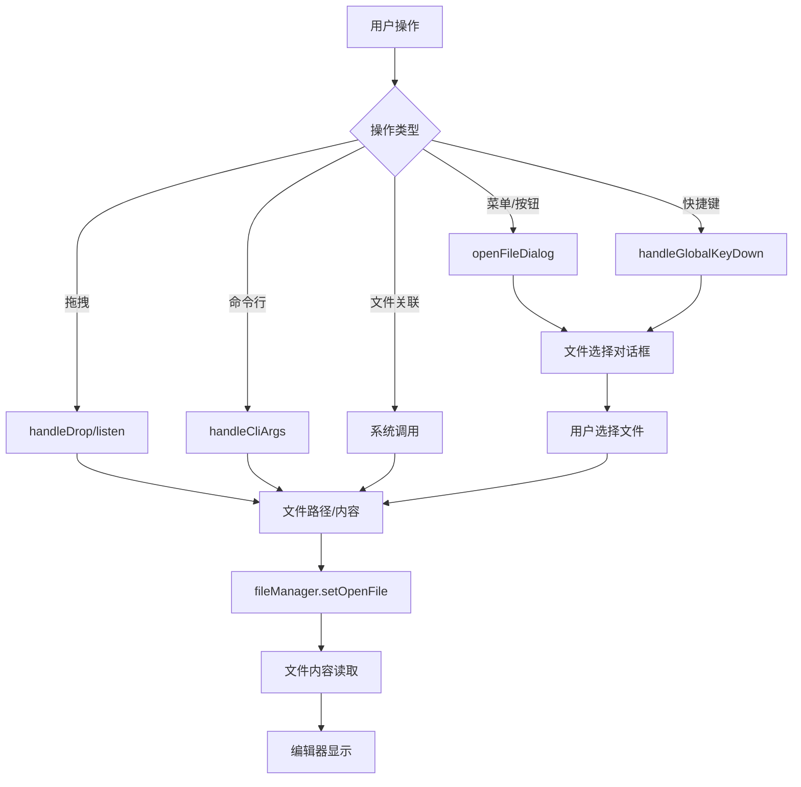

# 文件打开方式支持文档

## 概述

Miaogu NotePad 提供了多种灵活的文件打开方式，支持不同用户习惯和使用场景。系统设计了完整的文件打开生态，包括图形界面操作、键盘快捷键、拖拽操作、命令行参数、文件关联等多种方式。

## 核心架构

### 技术栈
- **前端框架**: React + Redux Toolkit
- **桌面框架**: Tauri
- **文件对话框**: @tauri-apps/plugin-dialog
- **拖拽支持**: HTML5 Drag & Drop API + Tauri 原生拖拽
- **键盘事件**: DOM Event API
- **文件系统**: Tauri 文件系统 API

### 核心组件
- `useFileManager.jsx` - 文件管理核心逻辑
- `App.jsx` - 全局键盘快捷键和拖拽处理
- `AppHeader.jsx` - 菜单栏文件操作
- `WelcomeScreen.jsx` - 欢迎界面文件操作
- `TabBar.jsx` - 标签页文件操作
- `tauriApi.js` - 文件系统 API 封装

## 文件打开方式详解

### 1. 图形界面操作

#### 1.1 菜单栏操作
**位置**: `src/components/AppHeader.jsx`

```javascript
// 文件菜单项配置
const fileMenuItems = [
  {
    key: 'new',
    label: t('header.fileMenu.new'),
    onClick: handleNewFile,
    icon: <FileAddOutlined />
  },
  {
    key: 'open',
    label: t('header.fileMenu.open'),
    onClick: handleOpenFile,
    icon: <FolderOpenOutlined />
  },
  // ... 其他菜单项
];

// 打开文件处理函数
const handleOpenFile = async () => {
  await openFileDialog();
};
```

**特性**:
- 支持国际化菜单文本
- 图标化界面设计
- 异步文件操作处理
- 错误处理机制

#### 1.2 欢迎界面操作
**位置**: `src/components/WelcomeScreen.jsx`

```javascript
// 欢迎界面按钮
<Button 
  type="primary" 
  icon={<FolderOpenOutlined />}
  onClick={handleOpenFile}
  size="large"
>
  {t('welcome.openFile')}
</Button>
```

**特性**:
- 新用户友好的引导界面
- 大按钮设计，易于点击
- 拖拽提示信息
- 响应式布局

#### 1.3 标签页操作
**位置**: `src/components/TabBar.jsx`

```javascript
// 标签页右键菜单
const contextMenuItems = [
  {
    key: 'rename',
    label: t('tabs.rename'),
    onClick: handleRename
  },
  {
    key: 'close',
    label: t('tabs.close'),
    onClick: handleClose
  }
  // ... 其他操作
];
```

### 2. 键盘快捷键

#### 2.1 全局快捷键实现
**位置**: `src/App.jsx`

```javascript
useEffect(() => {
  const handleGlobalKeyDown = async (event) => {
    // Ctrl+N 新建文件
    if (event.ctrlKey && event.key === 'n' && !event.shiftKey) {
      event.preventDefault();
      event.stopPropagation();
      await fileManager.createFile();
    }

    // Ctrl+O 打开文件
    if (event.ctrlKey && event.key === 'o' && !event.shiftKey) {
      event.preventDefault();
      event.stopPropagation();
      await fileManager.openFile();
    }

    // Ctrl+S 保存文件
    if (event.ctrlKey && event.key === 's' && !event.shiftKey) {
      event.preventDefault();
      event.stopPropagation();
      if (fileManager.currentFile) {
        await fileManager.saveFile(false);
      }
    }

    // Ctrl+Shift+S 另存为
    if (event.ctrlKey && event.shiftKey && event.key === 'S') {
      event.preventDefault();
      event.stopPropagation();
      if (fileManager.currentFile) {
        await fileManager.saveFile(true);
      }
    }
  };

  // 使用捕获阶段监听，确保优先处理
  document.addEventListener('keydown', handleGlobalKeyDown, true);
  return () => {
    document.removeEventListener('keydown', handleGlobalKeyDown, true);
  };
}, [fileManager]);
```

#### 2.2 支持的快捷键
| 快捷键 | 功能 | 说明 |
|--------|------|------|
| `Ctrl+N` | 新建文件 | 创建新的未命名文件 |
| `Ctrl+O` | 打开文件 | 打开文件选择对话框 |
| `Ctrl+S` | 保存文件 | 保存当前文件 |
| `Ctrl+Shift+S` | 另存为 | 另存为新文件 |
| `Ctrl+F` | 查找 | 在编辑器中查找文本 |
| `Ctrl+H` | 替换 | 查找并替换文本 |

**特性**:
- 全局快捷键支持，即使在全屏模式下也可使用
- 事件捕获阶段处理，确保优先级
- 防止默认行为和事件冒泡
- 完整的错误处理

### 3. 拖拽操作

#### 3.1 Tauri 环境拖拽
**位置**: `src/hooks/useFileManager.jsx`

Tauri 环境下使用原生拖拽事件监听，可直接获取系统文件路径：

```javascript
import { listen } from '@tauri-apps/api/event'

// 监听文件拖拽放置事件
const unlistenFileDrop = listen('tauri://drag-drop', async (event) => {
    // 隐藏拖拽覆盖层
    window.dispatchEvent(new CustomEvent('tauri-drag-leave'));

    const { paths } = event.payload;
    if (Array.isArray(paths) && paths.length > 0) {
        for (const path of paths) {
            try {
                // 检查是否为目录
                const isDirectory = await fileApi.isDirectory(path);
                
                if (isDirectory) {
                    // 如果是目录，更新面包屑导航
                    window.dispatchEvent(new CustomEvent('update-breadcrumb', {
                        detail: { path }
                    }));
                } else {
                    // 如果是文件，直接打开
                    await handleFileOpen(path);
                }
            } catch (error) {
                // 错误处理：尝试作为文件打开
                try {
                    await handleFileOpen(path);
                } catch (fileError) {
                    console.error('Failed to open as file:', path, fileError);
                }
            }
        }
    }
})

// 监听拖拽进入事件
const unlistenDragEnter = listen('tauri://drag-enter', (_) => {
    window.dispatchEvent(new CustomEvent('tauri-drag-enter'));
})

// 监听拖拽离开事件  
const unlistenDragLeave = listen('tauri://drag-leave', (_) => {
    window.dispatchEvent(new CustomEvent('tauri-drag-leave'));
})
```

**Tauri 拖拽事件类型**：
- `tauri://drag-drop` - 文件放置事件，payload包含文件路径数组
- `tauri://drag-enter` - 拖拽进入窗口事件
- `tauri://drag-leave` - 拖拽离开窗口事件

**配置启用**：
在 `src-tauri/tauri.conf.json` 中启用拖拽功能：

```json
{
  "app": {
    "windows": [
      {
        "dragDropEnabled": true
      }
    ]
  }
}
```

#### 3.2 Web 环境拖拽
**位置**: `src/App.jsx`

Web 环境下使用 HTML5 Drag & Drop API，通过 FileReader 读取文件内容：

```javascript
/**
 * 处理拖拽悬停事件
 */
const handleDragOver = useCallback((e) => {
    e.preventDefault();
    e.stopPropagation();
    
    if (!isDragOver) {
        setIsDragOver(true);
    }
}, [isDragOver]);

/**
 * 处理拖拽进入事件
 */
const handleDragEnter = useCallback((e) => {
    e.preventDefault();
    e.stopPropagation();
    setIsDragOver(true);
}, []);

/**
 * 处理拖拽离开事件
 */
const handleDragLeave = useCallback((e) => {
    e.preventDefault();
    e.stopPropagation();

    const rect = e.currentTarget.getBoundingClientRect();
    const x = e.clientX;
    const y = e.clientY;

    // 检查鼠标是否真正离开了拖拽区域
    if (x < rect.left || x > rect.right || y < rect.top || y > rect.bottom) {
        setIsDragOver(false);
    }
}, []);

/**
 * 处理文件拖拽放置事件
 */
const handleDrop = useCallback(async (e) => {
    e.preventDefault();
    e.stopPropagation();
    setIsDragOver(false);

    const hasTauri = typeof window !== 'undefined' && window['__TAURI_INTERNALS__'] !== undefined;

    if (!hasTauri) {
        const files = Array.from(e.dataTransfer.files);

        if (files.length === 0) {
            return;
        }

        for (const file of files) {
            try {
                if (file.webkitRelativePath) {
                    // 处理文件夹拖拽
                    await fileManager.setOpenFile(file.webkitRelativePath);
                } else {
                    // 处理单个文件
                    let content;
                    let fileName = file.name;

                    try {
                        // 使用FileReader读取文件内容
                        content = await new Promise((resolve, reject) => {
                            const reader = new FileReader();
                            reader.onload = (e) => resolve(e.target.result);
                            reader.onerror = (e) => reject(e);
                            reader.readAsText(file, 'UTF-8');
                        });

                        await fileManager.setOpenFile(fileName, content, {
                            encoding: 'UTF-8',
                            lineEnding: 'LF'
                        });
                    } catch (error) {
                        // 读取失败时创建空文件
                        console.error('Failed to read file:', error);
                        await fileManager.setOpenFile(fileName, '', {
                            encoding: 'UTF-8',
                            lineEnding: 'LF'
                        });
                    }
                }
            } catch (error) {
                console.error('Error processing file:', error);
            }
        }
    }
}, [fileManager]);
```

#### 3.3 环境检测与处理逻辑分离

**环境检测**：
```javascript
const hasTauri = typeof window !== 'undefined' && window['__TAURI_INTERNALS__'] !== undefined;
```

**处理逻辑分离**：
- **Tauri环境**：使用原生事件监听，直接获取文件系统路径
- **Web环境**：使用HTML5 API，通过FileReader读取文件内容

#### 3.4 文件类型处理

**文件与目录区分**：
在Tauri环境中，通过 `fileApi.isDirectory(path)` 检查拖拽项是否为目录：
- **目录**：更新面包屑导航，不打开编辑器
- **文件**：直接在编辑器中打开

**错误处理**：
```javascript
try {
    const isDirectory = await fileApi.isDirectory(path);
    if (isDirectory) {
        // 处理目录
    } else {
        // 处理文件
    }
} catch (error) {
    // 如果检查失败，尝试作为文件处理
    try {
        await handleFileOpen(path);
    } catch (fileError) {
        console.error('Failed to open as file:', path, fileError);
    }
}
```

### 4. 命令行参数支持

#### 4.1 Tauri 后端实现
**位置**: `src-tauri/src/lib.rs`

```rust
#[tauri::command]
async fn get_cli_args() -> Result<Vec<String>, String> {
    let args: Vec<String> = std::env::args().collect();
    
    // 过滤掉程序名和 Tauri 内部参数
    let filtered_args: Vec<String> = args.into_iter()
        .skip(1) // 跳过程序名
        .filter(|arg| {
            !arg.starts_with("--") && 
            !arg.contains("tauri") &&
            !arg.is_empty()
        })
        .collect();

    Ok(filtered_args)
}
```

#### 4.2 前端处理逻辑
**位置**: `src/App.jsx`

```javascript
useEffect(() => {
  const handleCliArgs = async () => {
    if (cliArgsProcessedRef.current) return;

    if (!isRestoring && !loading) {
      cliArgsProcessedRef.current = true;

      try {
        const args = await appApi.getCliArgs();

        if (args && args.length > 0) {
          const filePath = args[0];

          if (filePath && typeof filePath === 'string') {
            try {
              // 验证文件存在性
              await fileApi.fileExists(filePath);
              // 打开文件
              await fileManager.setOpenFile(filePath);
              return;
            } catch (error) {
              console.error('Failed to open CLI file:', error);
            }
          }
        }
      } catch (error) {
        console.error('Failed to get CLI args:', error);
      }

      // Web 环境下的调试支持
      if (!window['__TAURI__']) {
        const debugFile = localStorage.getItem('miaogu-notepad-debug-file');
        if (debugFile) {
          try {
            await fileManager.setOpenFile(debugFile);
            return;
          } catch (error) {
            console.error('Failed to open debug file:', error);
          }
        }
      }
    }
  };

  handleCliArgs();
}, [isRestoring, loading]);
```

#### 4.3 使用方式
```bash
# Windows
miaogu-notepad.exe "C:\path\to\file.txt"

# macOS/Linux
./miaogu-notepad "/path/to/file.txt"
```

### 5. 文件关联

#### 5.1 配置文件关联
**位置**: `src-tauri/tauri.conf.json`

```json
{
  "bundle": {
    "fileAssociations": [
      {
        "ext": ["txt"],
        "name": "Text File",
        "description": "Plain text file"
      },
      {
        "ext": ["md"],
        "name": "Markdown File", 
        "description": "Markdown document"
      },
      {
        "ext": ["js"],
        "name": "JavaScript File",
        "description": "JavaScript source file"
      },
      {
        "ext": ["json"],
        "name": "JSON File",
        "description": "JSON data file"
      },
      {
        "ext": ["html"],
        "name": "HTML File",
        "description": "HTML document"
      },
      {
        "ext": ["css"],
        "name": "CSS File",
        "description": "CSS stylesheet"
      },
      {
        "ext": ["py"],
        "name": "Python File",
        "description": "Python source file"
      },
      {
        "ext": ["xml"],
        "name": "XML File",
        "description": "XML document"
      },
      {
        "ext": ["log"],
        "name": "Log File",
        "description": "Log file"
      },
      {
        "ext": ["cfg"],
        "name": "Configuration File",
        "description": "Configuration file"
      },
      {
        "ext": ["ini"],
        "name": "INI File",
        "description": "INI configuration file"
      }
    ]
  }
}
```

#### 5.2 系统文件关联设置

##### Windows 系统设置

**方法一：通过右键菜单设置**
1. 右键点击要关联的文件类型（如 `.txt` 文件）
2. 选择"打开方式" → "选择其他应用"
3. 在应用列表中找到"喵咕记事本"
4. 勾选"始终使用此应用打开 .txt 文件"
5. 点击"确定"

**方法二：通过系统设置**
1. 打开"设置" → "应用" → "默认应用"
2. 点击"按文件类型选择默认应用"
3. 找到要关联的文件扩展名（如 `.txt`）
4. 点击当前默认应用，选择"喵咕记事本"

**方法三：通过控制面板**
1. 打开"控制面板" → "程序" → "默认程序"
2. 选择"将文件类型或协议与程序关联"
3. 找到要关联的文件扩展名
4. 双击该扩展名，选择"喵咕记事本"

##### macOS 系统设置

**方法一：通过右键菜单设置**
1. 右键点击要关联的文件
2. 选择"显示简介"
3. 在"打开方式"部分选择"喵咕记事本"
4. 点击"全部更改..."按钮
5. 确认更改

**方法二：通过系统偏好设置**
1. 选择文件，按 `Cmd + I` 打开简介
2. 展开"打开方式"部分
3. 从下拉菜单中选择"喵咕记事本"
4. 点击"全部更改..."

##### Linux 系统设置

**方法一：通过桌面环境设置**
1. 右键点击文件，选择"属性"
2. 切换到"打开方式"标签页
3. 选择"喵咕记事本"作为默认应用
4. 点击"设为默认"

**方法二：通过命令行设置**
```bash
# 使用 xdg-mime 设置默认应用
xdg-mime default miaogu-notepad.desktop text/plain
xdg-mime default miaogu-notepad.desktop text/markdown
```

#### 5.3 文件关联验证

设置完成后，可以通过以下方式验证文件关联是否生效：

1. **双击测试**: 双击相关文件类型，应该自动用喵咕记事本打开
2. **右键菜单**: 右键点击文件，"打开方式"中应显示喵咕记事本为默认应用
3. **系统信息**: 在系统的默认应用设置中，相关文件类型应显示为喵咕记事本

#### 5.4 文件关联的技术实现

**Tauri 配置自动注册**
当应用安装时，Tauri 会根据 `tauri.conf.json` 中的 `fileAssociations` 配置自动向系统注册文件关联：

```json
{
  "bundle": {
    "active": true,
    "targets": "all",
    "fileAssociations": [
      // 文件关联配置会在安装时自动注册到系统
    ]
  }
}
```

**命令行参数处理**
当用户双击关联的文件时，系统会将文件路径作为命令行参数传递给应用：

```rust
// Rust 后端获取命令行参数
#[tauri::command]
async fn get_cli_args() -> Result<Vec<String>, String> {
    let args: Vec<String> = std::env::args().collect();
    
    // 过滤并处理文件路径参数
    let filtered_args: Vec<String> = args.into_iter()
        .skip(1) // 跳过程序路径
        .filter(|arg| {
            !arg.starts_with("--") && 
            !arg.contains("tauri") &&
            !arg.is_empty()
        })
        .map(|arg| {
            // 将相对路径转换为绝对路径
            let path = Path::new(&arg);
            if path.is_relative() {
                match std::env::current_dir() {
                    Ok(current_dir) => {
                        let absolute_path = current_dir.join(path);
                        absolute_path.to_string_lossy().to_string()
                    },
                    Err(_) => arg
                }
            } else {
                arg
            }
        })
        .collect();

    Ok(filtered_args)
}
```

**前端参数处理**
```javascript
// 前端处理命令行参数
useEffect(() => {
    const processCliArgs = async () => {
        try {
            const args = await appApi.getCliArgs();
            if (args && args.length > 0) {
                const filePath = args[0];
                if (filePath && filePath.trim() !== '') {
                    // 尝试打开文件
                    await fileManager.handleFileOpen(filePath);
                }
            }
        } catch (error) {
            console.error('Error processing CLI args:', error);
        }
    };

    processCliArgs();
}, [fileManager]);
```

#### 5.5 常见问题与解决方案

**问题1：文件关联未生效**
- **原因**: 安装包未正确注册文件关联
- **解决**: 重新安装应用，或手动设置文件关联

**问题2：双击文件无法打开**
- **原因**: 命令行参数处理异常
- **解决**: 检查 `get_cli_args` 函数的实现和错误处理

**问题3：部分文件类型无法关联**
- **原因**: 系统权限限制或文件类型已被其他应用占用
- **解决**: 以管理员权限运行，或通过系统设置强制更改

**问题4：文件路径包含特殊字符**
- **原因**: 命令行参数解析时特殊字符处理不当
- **解决**: 在参数处理中添加特殊字符转义和路径规范化

#### 5.2 支持的文件类型
| 扩展名 | 文件类型 | 描述 |
|--------|----------|------|
| `.txt` | 文本文件 | 纯文本文档 |
| `.md` | Markdown | Markdown 文档 |
| `.js` | JavaScript | JavaScript 源文件 |
| `.json` | JSON | JSON 数据文件 |
| `.html` | HTML | HTML 文档 |
| `.css` | CSS | CSS 样式表 |

### 6. 文件对话框

#### 6.1 打开文件对话框
**位置**: `src/utils/tauriApi.js`

```javascript
async openFileDialog(t) {
  try {
    return await open({
      multiple: false,
      title: t ? t('dialog.fileDialog.openFile') : 'Open File',
      filters: [{
        name: t ? t('dialog.fileFilter.allFiles') : 'All Files',
        extensions: ['*']
      }]
    });
  } catch (error) {
    throw error;
  }
}
```

#### 6.2 保存文件对话框
```javascript
async saveFileDialog(defaultName = 'untitled.txt', t, isNewFile = false) {
  try {
    let finalDefaultName = defaultName;
    if (defaultName && !defaultName.includes('.')) {
      finalDefaultName = `${defaultName}.txt`;
    }

    const title = isNewFile
      ? (t ? t('dialog.fileDialog.saveAs') : 'Save As')
      : (t ? t('dialog.fileDialog.saveFile') : 'Save File');

    return await save({
      defaultPath: finalDefaultName,
      title: title,
      filters: [{
        name: t ? t('dialog.fileFilter.allFiles') : 'All Files',
        extensions: ['*']
      }]
    });
  } catch (error) {
    throw error;
  }
}
```

#### 6.3 特殊对话框
```javascript
// 图片选择对话框
async selectImageDialog(t) {
  try {
    const selected = await open({
      title: t ? t('dialog.fileDialog.selectImage') : 'Select Image',
      multiple: false,
      filters: [{
        name: 'Images',
        extensions: ['png', 'jpg', 'jpeg', 'gif', 'bmp', 'webp', 'svg']
      }]
    });

    if (selected && !Array.isArray(selected)) {
      const base64 = await this.readBinaryFile(selected);
      const ext = selected.split('.').pop().toLowerCase();
      let mimeType = 'image/jpeg';
      if (ext === 'png') mimeType = 'image/png';
      else if (ext === 'gif') mimeType = 'image/gif';
      // ... 其他格式处理
      
      return `data:${mimeType};base64,${base64}`;
    }
    return null;
  } catch (error) {
    throw error;
  }
}
```

## 文件处理流程

### 1. 文件打开流程


### 2. 错误处理机制
```javascript
// 统一错误处理
const handleFileOpen = async (filePath) => {
  try {
    // 1. 验证文件路径
    if (!filePath || typeof filePath !== 'string') {
      throw new Error('Invalid file path');
    }

    // 2. 检查文件存在性
    await fileApi.fileExists(filePath);

    // 3. 读取文件内容
    const result = await fileApi.setOpenFile(filePath);
    
    if (!result.success) {
      throw new Error(result.message || 'Failed to open file');
    }

    // 4. 更新文件管理器状态
    await fileManager.setOpenFile(filePath, result.content, {
      encoding: result.encoding,
      lineEnding: result.lineEnding
    });

  } catch (error) {
    console.error('File open error:', error);
    
    // 用户友好的错误提示
    if (error.message.includes('not found')) {
      message.error(t('error.fileNotFound'));
    } else if (error.message.includes('permission')) {
      message.error(t('error.permissionDenied'));
    } else {
      message.error(t('error.unknownError'));
    }
  }
};
```

## 性能优化

### 1. 异步操作
- 所有文件操作都使用异步处理
- 避免阻塞 UI 线程
- 提供加载状态反馈

### 2. 内存管理
- 大文件分块读取
- 及时清理文件内容缓存
- 限制同时打开的文件数量

### 3. 事件优化
- 使用事件委托减少监听器数量
- 防抖处理频繁的拖拽事件
- 及时清理事件监听器

## 用户体验

### 1. 视觉反馈
- 拖拽时显示覆盖层提示
- 文件打开过程中显示加载状态
- 操作成功/失败的消息提示

### 2. 国际化支持
- 所有界面文本支持多语言
- 文件对话框标题本地化
- 错误消息本地化

### 3. 无障碍访问
- 键盘快捷键支持
- 屏幕阅读器友好
- 高对比度主题支持

## 扩展性

### 1. 新文件类型支持
```javascript
// 在 tauri.conf.json 中添加新的文件关联
{
  "ext": ["py"],
  "name": "Python File",
  "description": "Python source file"
}
```

### 2. 自定义打开方式
```javascript
// 扩展文件管理器
const customFileOpener = {
  async openSpecialFile(filePath) {
    // 自定义打开逻辑
  }
};

fileManager.registerCustomOpener('special', customFileOpener);
```

### 3. 插件系统
```javascript
// 文件打开插件接口
interface FileOpenPlugin {
  name: string;
  supportedExtensions: string[];
  openFile(filePath: string): Promise<void>;
}
```

## 总结

Miaogu NotePad 的文件打开支持系统具有以下特点：

### 技术特点
- **多方式支持**: 图形界面、快捷键、拖拽、命令行、文件关联
- **跨平台兼容**: 同时支持桌面和 Web 环境
- **原生性能**: Tauri 环境下直接使用系统 API
- **优雅降级**: Web 环境下提供完整的文件读取功能

### 功能特点
- **用户友好**: 直观的操作界面和视觉反馈
- **错误恢复**: 完善的错误处理和回退机制
- **国际化**: 全面的多语言支持
- **可扩展**: 灵活的插件和扩展机制

### 性能特点
- **异步处理**: 非阻塞的文件操作
- **内存优化**: 高效的文件内容管理
- **事件优化**: 优化的事件处理机制

这种全面的文件打开支持确保了应用在不同使用场景下都能提供一致且可靠的文件操作体验。