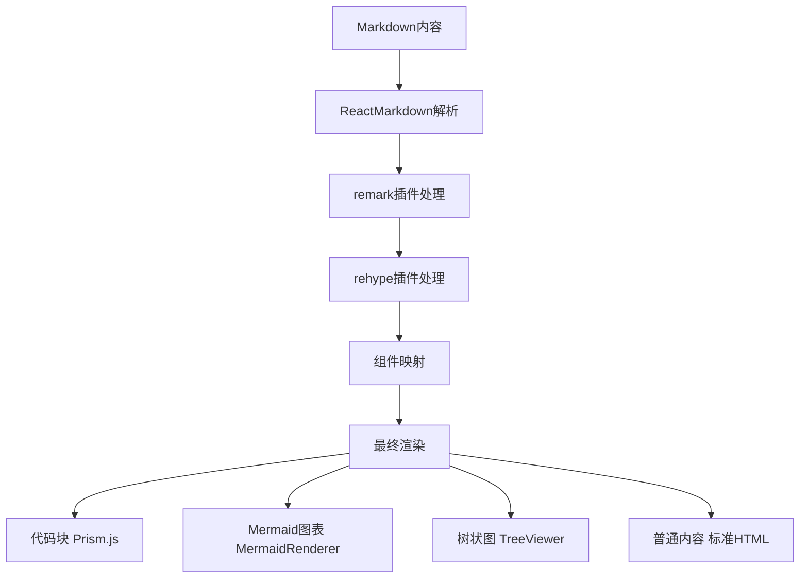

# Markdown渲染实现方案

## 概述

本项目采用了一套完整的Markdown渲染解决方案，支持标准Markdown语法、GitHub风格扩展、代码高亮、Mermaid图表渲染以及自定义组件集成。整个渲染系统基于React生态构建，提供了高性能和可扩展的Markdown内容展示能力。

## 核心架构

### 主要组件结构

```
MarkdownViewer (主渲染器)
├── ReactMarkdown (核心渲染引擎)
├── Prism.js (代码语法高亮)
├── TreeViewer (树状图渲染)
├── MermaidRenderer (流程图渲染)
└── 自定义组件集成
```

## 技术栈详解

### 1. ReactMarkdown - 核心渲染引擎

| 特性                 | 描述                   | 配置                                 |
| -------------------- | ---------------------- | ------------------------------------ |
| **基础渲染**   | 标准Markdown语法支持   | `ReactMarkdown` 组件               |
| **插件系统**   | 支持remark和rehype插件 | `remarkPlugins`, `rehypePlugins` |
| **组件自定义** | 自定义HTML元素渲染     | `components` 属性                  |
| **安全性**     | XSS防护和内容过滤      | 内置安全机制                         |

#### 基础配置示例

```jsx
import ReactMarkdown from 'react-markdown';
import remarkGfm from 'remark-gfm';
import rehypeRaw from 'rehype-raw';

<ReactMarkdown
  remarkPlugins={[remarkGfm]}
  rehypePlugins={[rehypeRaw]}
  components={{
    code: CustomCodeBlock,
    pre: CustomPreBlock,
    // 更多自定义组件...
  }}
>
  {markdownContent}
</ReactMarkdown>
```

### 2. 插件生态系统

#### remark插件 (Markdown AST处理)

| 插件名称               | 功能               | 用途                             |
| ---------------------- | ------------------ | -------------------------------- |
| **remark-gfm**   | GitHub风格Markdown | 表格、删除线、任务列表、自动链接 |
| **remark-math**  | 数学公式支持       | LaTeX数学表达式渲染              |
| **remark-emoji** | Emoji支持          | 😄 等emoji语法                   |

#### rehype插件 (HTML AST处理)

| 插件名称                   | 功能         | 用途                         |
| -------------------------- | ------------ | ---------------------------- |
| **rehype-raw**       | 原始HTML支持 | 允许在Markdown中使用HTML标签 |
| **rehype-sanitize**  | 内容清理     | XSS防护和安全过滤            |
| **rehype-highlight** | 代码高亮     | 语法高亮处理                 |

### 3. 代码语法高亮 - Prism.js

#### 高亮特性

| 特性               | 实现方式         | 支持语言      |
| ------------------ | ---------------- | ------------- |
| **语法高亮** | Prism.js核心     | 200+ 编程语言 |
| **主题支持** | CSS主题切换      | 多种内置主题  |
| **行号显示** | line-numbers插件 | 可选启用      |
| **代码复制** | 自定义工具栏     | 一键复制功能  |

#### 配置示例

```jsx
// Prism.js配置
import Prism from 'prismjs';
import 'prismjs/themes/prism-tomorrow.css';
import 'prismjs/components/prism-javascript';
import 'prismjs/components/prism-typescript';
import 'prismjs/components/prism-jsx';
import 'prismjs/components/prism-python';

// 自定义代码块组件
const CustomCodeBlock = ({ className, children, ...props }) => {
  const match = /language-(\w+)/.exec(className || '');
  const language = match ? match[1] : '';
  
  return (
    <div className="code-block-container">
      <div className="code-header">
        <span className="language-label">{language}</span>
        <button onClick={() => copyToClipboard(children)}>
          复制代码
        </button>
      </div>
      <pre className={className} {...props}>
        <code>{children}</code>
      </pre>
    </div>
  );
};
```

### 4. Mermaid图表渲染

#### MermaidRenderer组件

| 功能               | 描述         | 支持类型                       |
| ------------------ | ------------ | ------------------------------ |
| **图表类型** | 多种图表支持 | 流程图、时序图、甘特图、类图等 |
| **主题适配** | 动态主题切换 | 跟随应用主题变化               |
| **交互性**   | 图表交互功能 | 点击、缩放、导出               |
| **错误处理** | 语法错误处理 | 友好的错误提示                 |

#### 实现架构

```jsx
// MermaidRenderer.jsx
import mermaid from 'mermaid';

const MermaidRenderer = ({ chart, theme = 'default' }) => {
  const [svg, setSvg] = useState('');
  const [error, setError] = useState(null);

  useEffect(() => {
    const renderChart = async () => {
      try {
        // 配置Mermaid主题
        mermaid.initialize({
          theme: theme === 'dark' ? 'dark' : 'default',
          themeVariables: {
            primaryColor: '#ff6b6b',
            primaryTextColor: '#333',
            // 更多主题变量...
          }
        });

        // 渲染图表
        const { svg } = await mermaid.render('mermaid-chart', chart);
        setSvg(svg);
        setError(null);
      } catch (err) {
        setError(err.message);
      }
    };

    renderChart();
  }, [chart, theme]);

  if (error) {
    return <div className="mermaid-error">图表渲染错误: {error}</div>;
  }

  return (
    <div 
      className="mermaid-container"
      dangerouslySetInnerHTML={{ __html: svg }}
    />
  );
};
```

#### 支持的图表类型

| 图表类型         | 语法标识            | 用途               | 示例                   |
| ---------------- | ------------------- | ------------------ | ---------------------- |
| **流程图** | `flowchart`       | 业务流程、算法逻辑 | `flowchart TD`       |
| **时序图** | `sequenceDiagram` | 系统交互、API调用  | `sequenceDiagram`    |
| **甘特图** | `gantt`           | 项目管理、时间规划 | `gantt`              |
| **类图**   | `classDiagram`    | 系统设计、架构图   | `classDiagram`       |
| **状态图** | `stateDiagram`    | 状态机、工作流     | `stateDiagram-v2`    |
| **饼图**   | `pie`             | 数据可视化         | `pie title 数据分布` |

### 5. TreeViewer集成

#### 树状图渲染

| 特性               | 实现            | 功能                   |
| ------------------ | --------------- | ---------------------- |
| **节点渲染** | 自定义React组件 | 可点击、可展开的树节点 |
| **数据解析** | JSON/YAML解析   | 支持多种数据格式       |
| **交互功能** | 展开/折叠、搜索 | 用户友好的交互体验     |
| **样式定制** | CSS模块化       | 主题适配和自定义样式   |

#### 使用示例

```jsx
// 在Markdown中使用TreeViewer
const components = {
  code: ({ className, children }) => {
    if (className === 'language-tree') {
      return <TreeViewer data={parseTreeData(children)} />;
    }
    return <CustomCodeBlock className={className}>{children}</CustomCodeBlock>;
  }
};
```

## 渲染流程

### 1. 内容解析流程



### 2. 组件渲染映射

| Markdown元素     | 自定义组件          | 功能增强                 |
| ---------------- | ------------------- | ------------------------ |
| **代码块** | `CustomCodeBlock` | 语法高亮、复制功能、行号 |
| **图片**   | `CustomImage`     | 懒加载、预览、缩放       |
| **链接**   | `CustomLink`      | 外链检测、安全跳转       |
| **表格**   | `CustomTable`     | 排序、筛选、响应式       |
| **标题**   | `CustomHeading`   | 锚点生成、目录导航       |

### 3. 性能优化策略

#### 渲染优化

| 策略               | 实现方式                       | 效果               |
| ------------------ | ------------------------------ | ------------------ |
| **虚拟滚动** | `react-window`               | 大文档性能优化     |
| **懒加载**   | `IntersectionObserver`       | 图片和图表按需加载 |
| **缓存机制** | `useMemo` + `localStorage` | 避免重复渲染       |
| **代码分割** | 动态import                     | 减少初始加载时间   |

#### 缓存实现

```jsx
const MarkdownViewer = ({ content, theme }) => {
  // 内容缓存
  const cachedContent = useMemo(() => {
    const cacheKey = `markdown_${hashContent(content)}`;
    const cached = localStorage.getItem(cacheKey);
  
    if (cached) {
      return JSON.parse(cached);
    }
  
    const processed = processMarkdown(content);
    localStorage.setItem(cacheKey, JSON.stringify(processed));
    return processed;
  }, [content]);

  // 主题适配
  const themeConfig = useMemo(() => ({
    prism: theme === 'dark' ? 'prism-tomorrow' : 'prism',
    mermaid: theme === 'dark' ? 'dark' : 'default'
  }), [theme]);

  return (
    <div className={`markdown-viewer ${theme}`}>
      <ReactMarkdown
        remarkPlugins={[remarkGfm]}
        rehypePlugins={[rehypeRaw]}
        components={createComponents(themeConfig)}
      >
        {cachedContent}
      </ReactMarkdown>
    </div>
  );
};
```

## 主题系统集成

### 1. 主题适配机制

| 组件                 | 主题支持     | 实现方式         |
| -------------------- | ------------ | ---------------- |
| **Prism.js**   | CSS主题切换  | 动态加载主题文件 |
| **Mermaid**    | 内置主题系统 | 配置主题变量     |
| **自定义组件** | CSS变量      | 响应主题变化     |

### 2. 主题配置

```jsx
// 主题配置对象
const themeConfigs = {
  light: {
    prism: 'prism',
    mermaid: 'default',
    variables: {
      '--bg-color': '#ffffff',
      '--text-color': '#333333',
      '--border-color': '#e1e4e8'
    }
  },
  dark: {
    prism: 'prism-tomorrow',
    mermaid: 'dark',
    variables: {
      '--bg-color': '#1a1a1a',
      '--text-color': '#e1e4e8',
      '--border-color': '#30363d'
    }
  }
};
```

## 扩展功能

### 1. 数学公式支持

```jsx
// KaTeX集成
import 'katex/dist/katex.min.css';
import { InlineMath, BlockMath } from 'react-katex';

const MathRenderer = ({ inline, children }) => {
  if (inline) {
    return <InlineMath math={children} />;
  }
  return <BlockMath math={children} />;
};
```

### 2. 目录生成

```jsx
// 自动目录生成
const generateTOC = (content) => {
  const headings = content.match(/^#{1,6}\s+.+$/gm) || [];
  return headings.map((heading, index) => {
    const level = heading.match(/^#+/)[0].length;
    const text = heading.replace(/^#+\s+/, '');
    const id = text.toLowerCase().replace(/\s+/g, '-');
  
    return { level, text, id, index };
  });
};
```

### 3. 搜索高亮

```jsx
// 内容搜索和高亮
const highlightSearchTerm = (content, searchTerm) => {
  if (!searchTerm) return content;
  
  const regex = new RegExp(`(${escapeRegExp(searchTerm)})`, 'gi');
  return content.replace(regex, '<mark>$1</mark>');
};
```

## 错误处理

### 1. 渲染错误处理

| 错误类型           | 处理策略     | 用户体验               |
| ------------------ | ------------ | ---------------------- |
| **语法错误** | 错误边界捕获 | 显示错误信息和原始内容 |
| **插件错误** | 降级渲染     | 跳过有问题的插件       |
| **网络错误** | 重试机制     | 自动重试和手动刷新     |
| **内存溢出** | 分块处理     | 大文档分页渲染         |

### 2. 错误边界实现

```jsx
class MarkdownErrorBoundary extends React.Component {
  constructor(props) {
    super(props);
    this.state = { hasError: false, error: null };
  }

  static getDerivedStateFromError(error) {
    return { hasError: true, error };
  }

  componentDidCatch(error, errorInfo) {
    console.error('Markdown渲染错误:', error, errorInfo);
  }

  render() {
    if (this.state.hasError) {
      return (
        <div className="markdown-error">
          <h3>渲染出错</h3>
          <p>内容渲染时发生错误，请检查Markdown语法。</p>
          <details>
            <summary>错误详情</summary>
            <pre>{this.state.error?.message}</pre>
          </details>
          <button onClick={() => this.setState({ hasError: false })}>
            重试
          </button>
        </div>
      );
    }

    return this.props.children;
  }
}
```

## 最佳实践

### 1. 性能优化建议

- **内容分块**: 大文档分页或虚拟滚动
- **懒加载**: 图片和图表按需加载
- **缓存策略**: 合理使用内存和本地缓存
- **代码分割**: 按需加载渲染组件

### 2. 安全性考虑

- **XSS防护**: 使用 `rehype-sanitize`清理HTML
- **内容过滤**: 限制危险标签和属性
- **CSP策略**: 配置内容安全策略
- **输入验证**: 验证Markdown内容格式

### 3. 可访问性支持

- **语义化HTML**: 正确的标签结构
- **键盘导航**: 支持Tab键导航
- **屏幕阅读器**: ARIA标签和描述
- **对比度**: 确保足够的颜色对比度

## 总结

本项目的Markdown渲染系统通过ReactMarkdown、Prism.js、Mermaid等技术栈的深度集成，提供了功能丰富、性能优异的Markdown内容展示能力。系统支持标准语法、代码高亮、图表渲染、主题适配等特性，同时具备良好的扩展性和错误处理机制，为用户提供了优秀的阅读和编辑体验。