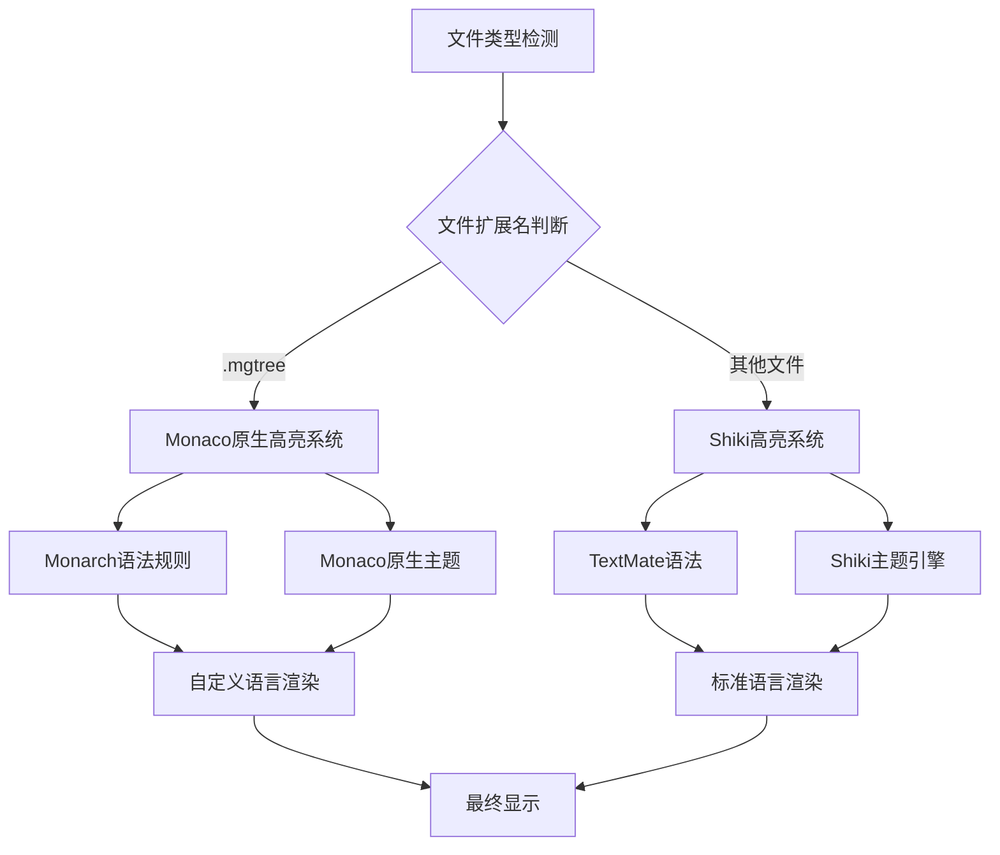

# Monaco编辑器高亮实现方案

## 概述

本项目采用了双重高亮系统，结合Monaco Editor原生高亮能力和Shiki高级语法高亮器，为不同类型的文件提供最优的语法高亮体验。系统支持200+编程语言、自定义语言扩展、主题动态切换以及高性能的渲染优化。

## 技术架构

### 双重高亮系统架构



### 核心组件结构

| 组件                    | 功能      | 技术栈                  |
|-----------------------|---------|----------------------|
| **Monaco Editor**     | 编辑器核心   | Monaco Editor 0.52.2 |
| **Shiki Highlighter** | 高级语法高亮  | Shiki + TextMate语法   |
| **Monarch Provider**  | 自定义语言支持 | Monaco Monarch API   |
| **Theme Manager**     | 主题管理系统  | 动态主题切换               |
| **Language Detector** | 语言检测器   | 基于文件扩展名映射            |

## Monaco原生高亮系统

### 1. Monarch语法规则

#### mgtree自定义语言实现

| 特性        | 实现方式         | 效果                       |
|-----------|--------------|--------------------------|
| **层级高亮**  | 基于缩进的token分类 | 不同层级使用不同颜色               |
| **代码引用块** | 反引号包围内容识别    | 代码片段特殊高亮                 |
| **跳转节点**  | 正则匹配特殊语法     | `>language[number]`蓝紫色高亮 |
| **注释支持**  | 行注释和块注释      | `//`和`/* */`语法           |

#### Monarch语法规则配置

```javascript
// mgtree-language.js
export const mgtreeLanguageConfig = {
    id: 'mgtree',
    extensions: ['.mgtree'],
    aliases: ['mgtree', 'MgTree'],

    // 语言配置
    configuration: {
        comments: {
            lineComment: '//',
            blockComment: ['/*', '*/']
        },
        brackets: [
            ['{', '}'], ['[', ']'], ['(', ')']
        ],
        autoClosingPairs: [
            {open: '{', close: '}'},
            {open: '[', close: ']'},
            {open: '(', close: ')'},
            {open: '`', close: '`'}
        ]
    },

    // Monarch语法规则
    monarchLanguage: {
        defaultToken: 'text',
        ignoreCase: false,

        // Token化规则
        tokenizer: {
            root: [
                // 跳转节点高亮 - 蓝紫色
                [/>(\w+)\[(\d+)\]/, 'jump-node'],

                // 代码引用块 - 橙色背景
                [/`[^`]*`/, 'inline-code'],

                // 层级检测 - 基于缩进
                [/^(\s*)(.*)$/, {
                    cases: {
                        '$1==""': ['', 'level-0'],      // 根级别 - 红色
                        '$1=="  "': ['', 'level-1'],    // 一级 - 橙色  
                        '$1=="    "': ['', 'level-2'],  // 二级 - 黄色
                        '$1=="      "': ['', 'level-3'], // 三级 - 绿色
                        '$1=="        "': ['', 'level-4'], // 四级 - 青色
                        '$1=="          "': ['', 'level-5'], // 五级 - 蓝色
                        '@default': ['', 'level-deep']   // 深层级 - 紫色
                    }
                }],

                // 注释支持
                [/\/\/.*$/, 'comment'],
                [/\/\*/, 'comment', '@comment']
            ],

            comment: [
                [/[^\/*]+/, 'comment'],
                [/\*\//, 'comment', '@pop'],
                [/[\/*]/, 'comment']
            ]
        }
    }
};
```

### 2. Monaco原生主题系统

#### 主题配置结构

| 主题元素        | 配置项       | 说明                    |
|-------------|-----------|-----------------------|
| **基础主题**    | `base`    | 继承vs、vs-dark或hc-black |
| **Token规则** | `rules`   | 定义各种token的颜色和样式       |
| **编辑器颜色**   | `colors`  | 编辑器UI元素颜色配置           |
| **继承设置**    | `inherit` | 是否继承基础主题              |

#### mgtree主题实现

```javascript
// mgtree-language.js
export const mgtreeThemeConfig = {
    light: {
        base: 'vs',
        inherit: true,
        rules: [
            // 层级颜色定义
            {token: 'level-0', foreground: 'e74c3c'},      // 红色
            {token: 'level-1', foreground: 'e67e22'},      // 橙色
            {token: 'level-2', foreground: 'f39c12'},      // 黄色
            {token: 'level-3', foreground: '27ae60'},      // 绿色
            {token: 'level-4', foreground: '16a085'},      // 青色
            {token: 'level-5', foreground: '3498db'},      // 蓝色
            {token: 'level-deep', foreground: '9b59b6'},   // 紫色

            // 特殊元素
            {token: 'jump-node', foreground: '8e44ad', fontStyle: 'bold'},
            {token: 'inline-code', foreground: 'd35400', background: 'fdf2e9'},
            {token: 'comment', foreground: '95a5a6', fontStyle: 'italic'}
        ],
        colors: {
            'editor.background': '#ffffff',
            'editor.foreground': '#2c3e50'
        }
    },

    dark: {
        base: 'vs-dark',
        inherit: true,
        rules: [
            // 暗色主题的层级颜色
            {token: 'level-0', foreground: 'ff6b6b'},
            {token: 'level-1', foreground: 'ffa726'},
            {token: 'level-2', foreground: 'ffcc02'},
            {token: 'level-3', foreground: '66bb6a'},
            {token: 'level-4', foreground: '26c6da'},
            {token: 'level-5', foreground: '42a5f5'},
            {token: 'level-deep', foreground: 'ab47bc'},

            {token: 'jump-node', foreground: 'ba68c8', fontStyle: 'bold'},
            {token: 'inline-code', foreground: 'ff8a65', background: '3e2723'},
            {token: 'comment', foreground: '78909c', fontStyle: 'italic'}
        ],
        colors: {
            'editor.background': '#1e1e1e',
            'editor.foreground': '#d4d4d4'
        }
    }
};
```

## Shiki高亮系统

### 1. Shiki集成架构

#### 核心特性

| 特性             | 描述              | 优势      |
|----------------|-----------------|---------|
| **TextMate语法** | 使用VS Code同款语法规则 | 高保真语法高亮 |
| **主题丰富**       | 支持VS Code所有主题   | 一致的视觉体验 |
| **语言全面**       | 200+编程语言支持      | 广泛的语言覆盖 |
| **性能优化**       | 异步渲染和缓存         | 流畅的编辑体验 |

#### 初始化流程

```javascript
// CodeEditor.jsx - Shiki初始化
const initializeThemesAndHighlighter = async () => {
    try {
        // 1. 获取支持的语言列表
        const validLanguages = Object.entries(extensionToLanguage)
            .filter(([key]) => !key.startsWith('_'))
            .map(([, value]) => value);

        // 2. 创建自定义主题对象
        const mgtreeThemes = [
            {
                name: 'mgtree-light',
                type: 'light',
                colors: mgtreeShikiTheme.light.colors,
                tokenColors: mgtreeShikiTheme.light.tokenColors
            },
            {
                name: 'mgtree-dark',
                type: 'dark',
                colors: mgtreeShikiTheme.dark.colors,
                tokenColors: mgtreeShikiTheme.dark.tokenColors
            }
        ];

        // 3. 创建Shiki高亮器
        const highlighter = await createHighlighter({
            themes: [...Object.values(themes).flat(), ...mgtreeThemes],
            langs: [...new Set(validLanguages)]
        });

        // 4. 加载自定义语言到Shiki
        await highlighter.loadLanguage(mgtreeTextMateGrammar);

        // 5. 使用官方API注册到Monaco
        shikiToMonaco(highlighter, monaco);

        setHighlighterReady(true);
    } catch (error) {
        console.error('Shiki初始化失败:', error);
    }
};
```

### 2. TextMate语法规则

#### mgtree的TextMate语法

```javascript
// mgtree-textmate.js
export const mgtreeTextMateGrammar = {
    name: 'mgtree',
    scopeName: 'source.mgtree',
    fileTypes: ['mgtree'],

    patterns: [
        // 跳转节点模式
        {
            name: 'meta.jump-node.mgtree',
            match: '(>)(\\w+)(\\[)(\\d+)(\\])',
            captures: {
                1: {name: 'punctuation.definition.jump.begin.mgtree'},
                2: {name: 'entity.name.type.language.mgtree'},
                3: {name: 'punctuation.definition.bracket.begin.mgtree'},
                4: {name: 'constant.numeric.line.mgtree'},
                5: {name: 'punctuation.definition.bracket.end.mgtree'}
            }
        },

        // 内联代码模式
        {
            name: 'markup.inline.raw.mgtree',
            begin: '`',
            end: '`',
            beginCaptures: {
                0: {name: 'punctuation.definition.raw.begin.mgtree'}
            },
            endCaptures: {
                0: {name: 'punctuation.definition.raw.end.mgtree'}
            },
            patterns: [
                {
                    name: 'markup.inline.raw.content.mgtree',
                    match: '[^`]+'
                }
            ]
        },

        // 层级标题模式
        {
            name: 'markup.heading.1.mgtree',
            match: '^([^\\s].*)',
            captures: {
                1: {name: 'entity.name.section.level-0.mgtree'}
            }
        },

        {
            name: 'markup.heading.2.mgtree',
            match: '^(  )([^\\s].*)',
            captures: {
                1: {name: 'punctuation.definition.heading.indent.mgtree'},
                2: {name: 'entity.name.section.level-1.mgtree'}
            }
        }
        // ... 更多层级定义
    ]
};
```

### 3. 主题系统集成

#### 主题切换机制

| 文件类型        | 主题系统     | 主题名称                     | 切换方式                       |
|-------------|----------|--------------------------|----------------------------|
| **.mgtree** | Monaco原生 | `mgtree-light/dark`      | `monaco.editor.setTheme()` |
| **其他文件**    | Shiki    | `one-light/one-dark-pro` | Shiki主题引擎                  |

#### 动态主题切换实现

```javascript
// CodeEditor.jsx - 主题切换逻辑
useEffect(() => {
    if (editorRef.current) {
        try {
            if (getCurrentTabFileName().endsWith('.mgtree')) {
                // mgtree文件使用Monaco原生主题
                const mgtreeTheme = isDarkMode ? 'mgtree-dark' : 'mgtree-light';

                try {
                    monaco.editor.setTheme(mgtreeTheme);
                } catch (setError) {
                    // 主题设置失败时重新定义
                    monaco.editor.defineTheme('mgtree-dark', mgtreeThemeConfig.dark);
                    monaco.editor.defineTheme('mgtree-light', mgtreeThemeConfig.light);
                    monaco.editor.setTheme(mgtreeTheme);
                }
            } else {
                // 其他文件使用Shiki主题
                const shikiTheme = isDarkMode ? 'one-dark-pro' : 'one-light';
                monaco.editor.setTheme(shikiTheme);
            }
        } catch (error) {
            // 降级到基础主题
            monaco.editor.setTheme(isDarkMode ? 'vs-dark' : 'vs');
        }
    }
}, [highlighterReady, isDarkMode, currentFile]);
```

## 语言检测与映射

### 1. 文件扩展名映射

#### 语言映射配置

```json
// file-extensions.json
{
  "_comment": "文件扩展名到语言的映射配置",
  "_supported_languages": "支持200+编程语言",
  "js": "javascript",
  "jsx": "javascriptreact",
  "ts": "typescript",
  "tsx": "typescriptreact",
  "py": "python",
  "java": "java",
  "cpp": "cpp",
  "c": "c",
  "cs": "csharp",
  "php": "php",
  "rb": "ruby",
  "go": "go",
  "rs": "rust",
  "swift": "swift",
  "kt": "kotlin",
  "scala": "scala",
  "sh": "shellscript",
  "bash": "shellscript",
  "zsh": "shellscript",
  "fish": "fish",
  "ps1": "powershell",
  "sql": "sql",
  "html": "html",
  "css": "css",
  "scss": "scss",
  "sass": "sass",
  "less": "less",
  "xml": "xml",
  "json": "json",
  "yaml": "yaml",
  "yml": "yaml",
  "toml": "toml",
  "ini": "ini",
  "cfg": "ini",
  "conf": "ini",
  "md": "markdown",
  "markdown": "markdown",
  "tex": "latex",
  "r": "r",
  "matlab": "matlab",
  "m": "matlab",
  "pl": "perl",
  "lua": "lua",
  "vim": "vim",
  "dockerfile": "dockerfile",
  "makefile": "makefile",
  "cmake": "cmake",
  "mgtree": "mgtree"
}
```

### 2. 语言检测逻辑

#### 检测流程

```javascript
// CodeEditor.jsx - 语言检测
const getFileLanguage = useCallback(() => {
    if (!currentFile?.name) return 'plaintext';

    // 1. 提取文件扩展名
    const extension = currentFile.name.split('.').pop()?.toLowerCase();
    if (!extension) return 'plaintext';

    // 2. 查找映射表
    const language = extensionToLanguage[extension];
    if (!language) return 'plaintext';

    // 3. 验证Monaco支持
    const supportedLanguages = monaco.languages.getLanguages();
    const isSupported = supportedLanguages.some(lang =>
        lang.id === language || lang.aliases?.includes(language)
    );

    return isSupported ? language : 'plaintext';
}, [currentFile]);
```

## 性能优化策略

### 1. 高亮器初始化优化

| 优化策略     | 实现方式                     | 效果      |
|----------|--------------------------|---------|
| **异步加载** | `createHighlighter`异步初始化 | 不阻塞UI渲染 |
| **按需加载** | 只加载需要的语言和主题              | 减少内存占用  |
| **错误降级** | 初始化失败时使用基础主题             | 保证基本功能  |
| **缓存机制** | 高亮结果缓存                   | 避免重复计算  |

### 2. 渲染性能优化

#### Monaco编辑器配置优化

```javascript
// CodeEditor.jsx - 性能配置
const editorOptions = {
    // 基础性能配置
    automaticLayout: true,
    scrollBeyondLastLine: false,
    minimap: {enabled: false}, // 可配置

    // 高亮性能优化
    'semanticHighlighting.enabled': true,
    'editor.tokenColorCustomizations': {},

    // 渲染优化
    renderWhitespace: 'selection',
    renderControlCharacters: false,
    renderLineHighlight: 'none',

    // 滚动优化
    smoothScrolling: true,
    mouseWheelScrollSensitivity: 1,
    fastScrollSensitivity: 5,

    // 内存优化
    wordBasedSuggestions: false,
    quickSuggestions: false,
    parameterHints: {enabled: false}
};
```

### 3. 主题切换优化

#### 防抖和缓存机制

```javascript
// 主题切换防抖
const debouncedThemeChange = useMemo(
    () => debounce((theme) => {
        if (editorRef.current) {
            monaco.editor.setTheme(theme);
        }
    }, 100),
    []
);

// 主题缓存
const themeCache = useMemo(() => new Map(), []);

const setEditorTheme = useCallback((themeName) => {
    if (themeCache.has(themeName)) {
        debouncedThemeChange(themeName);
        return;
    }

    // 验证主题存在性
    try {
        monaco.editor.setTheme(themeName);
        themeCache.set(themeName, true);
    } catch (error) {
        console.warn(`主题 ${themeName} 不存在，使用默认主题`);
        const fallbackTheme = isDarkMode ? 'vs-dark' : 'vs';
        monaco.editor.setTheme(fallbackTheme);
    }
}, [isDarkMode, debouncedThemeChange, themeCache]);
```

## 错误处理机制

### 1. 高亮器错误处理

| 错误类型           | 处理策略      | 降级方案         |
|----------------|-----------|--------------|
| **Shiki初始化失败** | 捕获异常，记录日志 | 使用Monaco原生高亮 |
| **主题加载失败**     | 重试机制      | 降级到基础主题      |
| **语言注册失败**     | 跳过有问题的语言  | 使用plaintext  |
| **内存不足**       | 清理缓存      | 禁用部分功能       |

### 2. 错误处理实现

```javascript
// 高亮器错误边界
class HighlighterErrorBoundary extends React.Component {
    constructor(props) {
        super(props);
        this.state = {hasError: false, errorInfo: null};
    }

    static getDerivedStateFromError(error) {
        return {hasError: true};
    }

    componentDidCatch(error, errorInfo) {
        console.error('高亮器错误:', error, errorInfo);

        // 错误上报
        this.reportError(error, errorInfo);

        // 降级处理
        this.fallbackToBasicHighlighting();
    }

    fallbackToBasicHighlighting = () => {
        // 切换到Monaco基础高亮
        if (window.monaco) {
            monaco.editor.setTheme('vs-dark');
        }
    };

    reportError = (error, errorInfo) => {
        // 错误统计和上报
        const errorData = {
            message: error.message,
            stack: error.stack,
            componentStack: errorInfo.componentStack,
            timestamp: new Date().toISOString()
        };

        console.error('高亮器错误详情:', errorData);
    };

    render() {
        if (this.state.hasError) {
            return (
                <div className="highlighter-error">
                    <p>语法高亮加载失败，已切换到基础模式</p>
                    <button onClick={() => window.location.reload()}>
                        重新加载
                    </button>
                </div>
            );
        }

        return this.props.children;
    }
}
```

## 扩展功能

### 1. 自定义语言支持

#### 添加新语言的步骤

| 步骤                | 操作             | 文件                     |
|-------------------|----------------|------------------------|
| **1. 扩展名映射**      | 添加文件扩展名到语言映射   | `file-extensions.json` |
| **2. Monarch规则**  | 定义Monaco语法规则   | 新建语言配置文件               |
| **3. TextMate语法** | 创建TextMate语法文件 | 新建语法定义文件               |
| **4. 主题适配**       | 定义语言特定的主题规则    | 主题配置文件                 |
| **5. 注册语言**       | 在编辑器中注册新语言     | `CodeEditor.jsx`       |

#### 示例：添加新语言

```javascript
// 1. 在file-extensions.json中添加映射
{
    "mylang"
:
    "mylanguage"
}

// 2. 创建Monarch语法规则
export const myLanguageConfig = {
    id: 'mylanguage',
    extensions: ['.mylang'],
    aliases: ['MyLanguage'],

    monarchLanguage: {
        tokenizer: {
            root: [
                [/\b(keyword1|keyword2)\b/, 'keyword'],
                [/\b\d+\b/, 'number'],
                [/"[^"]*"/, 'string'],
                [/\/\/.*$/, 'comment']
            ]
        }
    }
};

// 3. 注册到Monaco
monaco.languages.register({id: 'mylanguage'});
monaco.languages.setMonarchTokensProvider('mylanguage', myLanguageConfig.monarchLanguage);
```

### 2. 主题定制

#### 自定义主题创建

```javascript
// 创建自定义主题
const createCustomTheme = (baseTheme, customColors) => {
    return {
        base: baseTheme, // 'vs', 'vs-dark', 'hc-black'
        inherit: true,
        rules: [
            {token: 'keyword', foreground: customColors.keyword},
            {token: 'string', foreground: customColors.string},
            {token: 'comment', foreground: customColors.comment, fontStyle: 'italic'},
            {token: 'number', foreground: customColors.number}
        ],
        colors: {
            'editor.background': customColors.background,
            'editor.foreground': customColors.foreground,
            'editorLineNumber.foreground': customColors.lineNumber
        }
    };
};

// 注册自定义主题
const customTheme = createCustomTheme('vs-dark', {
    keyword: 'ff6b6b',
    string: '4ecdc4',
    comment: '95a5a6',
    number: 'f39c12',
    background: '#2c3e50',
    foreground: '#ecf0f1',
    lineNumber: '#7f8c8d'
});

monaco.editor.defineTheme('my-custom-theme', customTheme);
```

### 3. 智能补全集成

#### AI补全与语法高亮的协同

```javascript
// AI补全提供器
const createCompletionProvider = (language) => {
    return monaco.languages.registerCompletionItemProvider(language, {
        provideCompletionItems: async (model, position) => {
            // 获取当前上下文
            const textUntilPosition = model.getValueInRange({
                startLineNumber: 1,
                startColumn: 1,
                endLineNumber: position.lineNumber,
                endColumn: position.column
            });

            // 调用AI服务获取补全建议
            const suggestions = await getAICompletions(textUntilPosition, language);

            return {
                suggestions: suggestions.map(item => ({
                    label: item.label,
                    kind: monaco.languages.CompletionItemKind.Text,
                    insertText: item.insertText,
                    documentation: item.documentation,
                    // 与语法高亮保持一致的样式
                    tags: item.tags
                }))
            };
        }
    });
};
```

## 最佳实践

### 1. 性能优化建议

- **延迟初始化**: 编辑器首次使用时才初始化Shiki
- **语言按需加载**: 只加载当前需要的语言支持
- **主题预加载**: 预加载常用主题，减少切换延迟
- **内存管理**: 定期清理不使用的语言和主题缓存

### 2. 开发建议

- **语法测试**: 为自定义语言编写完整的测试用例
- **主题一致性**: 确保自定义主题与应用整体风格一致
- **错误处理**: 完善的错误处理和降级机制
- **文档维护**: 及时更新语言支持和主题配置文档

### 3. 用户体验优化

- **加载提示**: 高亮器初始化时显示加载状态
- **平滑过渡**: 主题切换时使用过渡动画
- **错误反馈**: 语法错误时提供友好的提示信息
- **性能监控**: 监控高亮渲染性能，及时优化

## 总结

本项目的Monaco编辑器高亮系统通过双重架构设计，既保证了自定义语言的灵活性，又充分利用了Shiki的强大功能。系统支持200+编程语言、动态主题切换、性能优化和完善的错误处理，为用户提供了专业级的代码编辑体验。通过Monaco原生高亮和Shiki高级高亮的结合，实现了功能丰富、性能优异的语法高亮解决方案。
